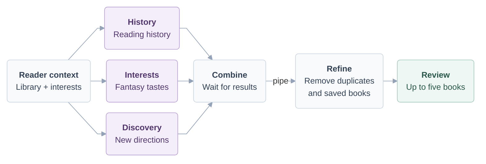

# The Fantasy Shelf

A small terminal book manager for a reader who enjoys all kinds of fantasy. Track books, look up metadata, and get AI
recommendations based on reading history, interests, and discovery.

## Setup and run

Requirements: Bash 3.2+, Gum, jq, Python 3, and curl. Codex CLI is needed only
for AI recommendations. On macOS with Homebrew:

```bash
brew install gum jq python
# If Codex CLI is not already installed:
brew install --cask codex
codex login
```

Choose **Sign in with ChatGPT**. This project uses your included Codex allowance;
it does not set up API billing. It refuses API-key login and requests ChatGPT
access explicitly. Your account needs Codex access, internet connectivity, and
remaining usage allowance. The CLI's configured model is retained. Install a
recent CLI supporting `exec --ephemeral --output-schema --output-last-message`.
See [Codex CLI](https://learn.chatgpt.com/docs/codex/cli) and
[authentication](https://learn.chatgpt.com/docs/auth).

On Linux, install Gum from its [official instructions](https://github.com/charmbracelet/gum#installation),
plus Bash, jq, Python 3, curl, and Codex CLI using your distribution's supported
installation methods.

From this directory:

```bash
bash app.sh
# Separate temporary fantasy library; discarded when you exit:
bash app.sh --demo
```

Use arrow keys and Enter to select, Esc to go back, and Quit to exit. The default
library includes sample records. Demo mode uses a separate temporary library;
its AI recommendations are live and consume Codex allowance.

The menu supports browsing, adding, searching, updating status/rating, and
getting recommendations. Adding a book offers metadata lookup or manual entry.
Review the details before saving. Search matches title, author, and genre.
Statuses are `want-to-read`, `reading`, and `finished`; ratings are optional 1–5.
For a recommendation, choose a book, select **Review and save**, edit or confirm
its details, and confirm the save. Open Library lookup is available in **Add Book**.

## Architecture

The application is organized into small Bash scripts with separate responsibilities.
`app.sh` starts the Gum interface in `ui/`, where users choose actions and view
results. `ui/library_screen.sh` also collects book inputs and save confirmations.
Scripts in `workflows/` coordinate library operations and recommendations,
while `books/` handles metadata lookup and searching. Only `data/book_database.sh`
reads or writes `data/books.csv`; the other components access the library through
that script. For recommendations, the workflow runs the history, interests, and
discovery scripts in `recommendations/` concurrently using `&`, tracks their process
IDs with `$!`, and waits for completion with `wait`. It then combines their outputs
and pipes them into `refine_recommendations.sh`, which removes duplicates and books
already in the library before the UI displays the shortlist. Scripts exchange book
records as JSON Lines, keeping progress messages separate from the data. Small
embedded Python sections handle CSV parsing, process cleanup, and text normalization.

The five logical layers, from user interaction to storage:


Inside the recommendation workflow, three strategies run in parallel. Their
results are combined, filtered, and displayed for review before saving.



## Recommendation logic

All three strategies call a large language model through `codex exec`, using the
existing ChatGPT login and configured model. The workflow supplies a library
snapshot through the data layer; each script selects or summarizes its own model
input. Recommendations come from the model's knowledge, not keyword searches or
Open Library queries. Each request asks for three real, published books with
`title`, `author`, `genre`, and a short spoiler-free `reason`.

| Script | Data sent to the model | Recommendation instructions |
| --- | --- | --- |
| `recommend_from_history.sh` | Individual titles, authors, genres, reading statuses, and ratings. The session interest is ignored. | Favor saved authors and genres, especially finished books rated 4–5; consider low ratings. Saving an unfinished book does not prove the reader liked it. When the library is empty, acknowledge the missing history and use the default fantasy/Tolkien preference. |
| `recommend_from_interests.sh` | The fixed fantasy/Tolkien preference and the optional session interest, such as dragons or cozy magic. No individual genres, statuses, or ratings. | Prioritize the current interest when supplied; otherwise explore the predefined fantasy interests. Do not infer tastes from the exclusion list. |
| `recommend_for_discovery.sh` | Counts by author and genre, saved and finished book totals, and genre counts for finished books rated 4–5, plus fixed and session interests. No individual ratings or statuses. | Explore beyond usual reading patterns, including adjacent or non-fantasy genres. Explain both the unfamiliar direction and its connection to the reader. Use the session interest as a bridge to exploration. With no saved books, use stated interests as the baseline. |

All three also receive saved titles and authors as an exclusion list. Discovery's
counts describe saved books, including unread ones. `jq` prepares the inputs, and
the model interprets them. The shared prompt requires structured JSON and instructs
the model not to use tools, run commands, or read or modify files.

Each script validates the returned fields and adds its strategy label. Refinement
cleans leading, trailing, and repeated whitespace in titles, authors, genres, and
reasons while preserving their wording. It normalizes titles and authors for
deduplication, removes saved books, and takes up to five results in History, Interests, Discovery round-robin order. This selection
uses code without another model request.

## Personalization

The Fantasy Shelf defaults to a broad interest in fantasy and Tolkien's
*The Lord of the Rings*. Session interests let the reader explore a current topic,
while the three strategies balance past reading, stated interests, and discovery.
The Gum interface uses a violet-and-gold fantasy library theme, bordered book
cards, and section headings. Cards adapt to terminal width; recommendations
include spoiler-free reasons.
The default library includes fantasy examples about hope, courage, and renewal.
Their randomly generated statuses and ratings are sample data and influence
recommendations until edited. The separate demo library also uses sample records.

## Failures and limitations

Library features work without Codex or internet access. Metadata comes from
[Open Library](https://openlibrary.org/dev/docs/api/search), with a 15-second
request timeout and manual entry when no usable result is available. Genre
suggestions are editable. AI suggestions can be inaccurate: review and correct
the selected recommendation before saving. Recommendations are not automatically
verified against Open Library.

Each AI call has a 120-second timeout. If one strategy fails, successful results
still appear. Failed calls show available error diagnostics. If all fail, the app
explains the failure and returns to its menus. There are no automatic AI retries
and no offline suggestion catalog. Last results remain in memory until exit;
browsing them again does not call Codex. Ctrl-C cancels active work (and may exit
the app); cleanup removes temporary data. Normal changes are saved immediately.

This is a local, single-user application: run only one writer against a library
at a time. The default CSV is part of the project, so review changes before
pushing personal reading data to GitHub.

## Component interfaces

Run components from any working directory. Set `BOOK_DB` to select a separate
CSV; otherwise it defaults to this project's `data/books.csv`.

```bash
bash data/book_database.sh list
bash data/book_database.sh search fantasy
printf '%s\n' '{"title":"The Hobbit","author":"J. R. R. Tolkien","genre":"Fantasy"}' \
  | bash data/book_database.sh add
printf '%s\n' '{"status":"finished","rating":"5"}' \
  | bash data/book_database.sh update 'The Hobbit' 'J. R. R. Tolkien'
bash data/book_database.sh exists 'The Hobbit' 'J. R. R. Tolkien'
echo fantasy | bash books/search_books.sh
bash books/fetch_book_metadata.sh 'The Hobbit' 'Tolkien'
bash workflows/get_recommendations.sh 'Dragons and epic journeys'
```

Book records use string fields `title,author,genre,status,rating,link`; omitted
optional fields are blank and a new book defaults to `want-to-read`. `add` and
`update` read one JSON object from stdin and return the saved record. `update`
accepts only status/rating. `list` and `search` return JSON Lines. `exists` returns
exit 0 if found and 1 if absent; invalid data or storage errors return 2.
Recommendation scripts read library JSON Lines from stdin, accept an optional
interest as argument 1 (ignored by History) and an optional schema path as argument 2, and return `title,author,genre,reason,strategy` JSON Lines.
Direct strategy calls create their own temporary schema if none is supplied.
Timeouts and process cleanup are managed by the workflow; use it for normal runs.
`BOOK_AI_TIMEOUT` overrides the workflow’s default 120 seconds for testing.

## Validation

```bash
# Optional: pip install pexpect (enables real Gum terminal tests)
python3 -m unittest discover -s tests -v
# Optional development tool: brew install shellcheck
shellcheck -x app.sh books/*.sh data/*.sh ui/*.sh workflows/*.sh recommendations/*.sh
```

Tests use temporary libraries and fake Codex/curl executables. They cover CSV
round trips, input validation, duplicate detection, metadata failures, balanced
refinement, overlapping AI processes, partial/total failures, malformed output,
authentication, timeouts, cancellation, and paths with spaces. The automated suite makes no live AI calls.
