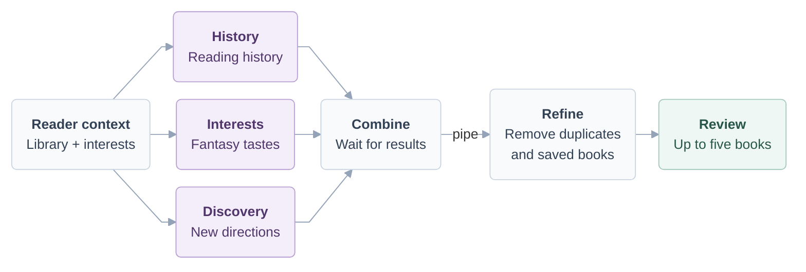

# The Fantasy Shelf

A small terminal book manager for a reader who enjoys all kinds of fantasy. Track books, look up metadata, and get AI
recommendations based on reading history, interests, and discovery.

## Demo Video

[Watch the narrated demo](demo-video.mp4)

## Setup and run

On macOS with Homebrew:

1. Install the dependencies:

   ```bash
   brew install gum jq python
   brew install --cask codex
   ```

2. Log in to Codex and choose **Sign in with ChatGPT**:

   ```bash
   codex login
   ```

3. From the project directory, start the application:

   ```bash
   bash app.sh
   ```

Use the arrow keys to navigate, Enter to select, Esc to go back, and Quit to exit.
For a temporary sample library, run `bash app.sh --demo`.

## Architecture

I split the application into small Bash scripts so each part has a clear job.
`app.sh` opens the Gum menus in `ui/`. These screens collect input and show results;
`ui/library_screen.sh` also lets me review book details before confirming a save.
The scripts in `workflows/` connect those actions to the right components:
`books/` handles searches and metadata lookup, and `recommendations/` generates
and refines suggestions. Whenever a component needs library data, it goes through
`data/book_database.sh`, the only script that reads or writes `data/books.csv`.
For recommendations, the workflow starts all three strategies with `&`, tracks
their process IDs with `$!`, and uses `wait` to collect their exit statuses.
It combines the results and pipes them into `refine_recommendations.sh` to remove
duplicates and books I already have, then returns the shortlist to the interface.
Book records pass between scripts as JSON Lines, with progress messages kept
separate so they do not get mixed into the results. Embedded Python handles CSV
parsing, process cleanup, and text normalization.

The five logical layers, from user interaction to storage:


Inside the recommendation workflow, three strategies run in parallel. Their
results are combined, filtered, and displayed for review before saving.



## Recommendation logic

All three strategies call a large language model through `codex exec`, using the
existing ChatGPT login and configured model. The workflow supplies a library
snapshot through the data layer; each script selects or summarizes its own model
input. Recommendations come from the model's knowledge, not keyword searches or
Open Library queries. Each request asks for three real, published books with
`title`, `author`, `genre`, and a short spoiler-free `reason`.

| Script | Data sent to the model | Recommendation instructions |
| --- | --- | --- |
| `recommend_from_history.sh` | Individual titles, authors, genres, reading statuses, and ratings. The session interest is ignored. | Favor saved authors and genres, especially finished books rated 4–5; consider low ratings. Saving an unfinished book does not prove the reader liked it. When the library is empty, acknowledge the missing history and use the default fantasy/Tolkien preference. |
| `recommend_from_interests.sh` | The fixed fantasy/Tolkien preference and the optional session interest, such as dragons or cozy magic. No individual genres, statuses, or ratings. | Prioritize the current interest when supplied; otherwise explore the predefined fantasy interests. Do not infer tastes from the exclusion list. |
| `recommend_for_discovery.sh` | Counts by author and genre, saved and finished book totals, and genre counts for finished books rated 4–5, plus fixed and session interests. No individual ratings or statuses. | Explore beyond usual reading patterns, including adjacent or non-fantasy genres. Explain both the unfamiliar direction and its connection to the reader. Use the session interest as a bridge to exploration. With no saved books, use stated interests as the baseline. |

All three also receive saved titles and authors as an exclusion list. Discovery's
counts describe saved books, including unread ones. `jq` prepares the inputs, and
the model interprets them. The shared prompt requires structured JSON and instructs
the model not to use tools, run commands, or read or modify files.

Each script validates the returned fields and adds its strategy label. Refinement
cleans leading, trailing, and repeated whitespace in titles, authors, genres, and
reasons while preserving their wording. It normalizes titles and authors for
deduplication, removes saved books, and takes up to five results in History, Interests, Discovery round-robin order. This selection
uses code without another model request.

## Personalization

I enjoy fantasy books, so I wanted the interface to feel a little like an old
scroll. I used purple and gold with small stars and decorative borders around
the titles and book details. The colors work with my white terminal background,
and the book cards adjust to the terminal width.

Fantasy also shapes the recommendations. The default interests include fantasy
and Tolkien's *The Lord of the Rings*, and I can enter a topic such as dragons
or epic journeys for a particular session. History uses my saved books and
ratings, while Discovery can take me beyond my usual genres. Each recommendation
includes a short, spoiler-free explanation of why I might enjoy it.

The sample books and input examples follow the same theme, including fantasy
stories about hope, courage, and renewal. The default library starts with sample
statuses and ratings, which affect recommendations until I update them. Demo
mode uses its own temporary sample library.

## Notes

- AI recommendations require internet access, a ChatGPT login with Codex access,
  and available Codex allowance. Local library features work without Codex or internet.
- AI book details may be inaccurate, so review them before saving. **Add Book**
  offers an Open Library lookup or manual entry.
- Normal mode saves changes to the library. Demo mode discards its temporary
  library when you exit, but its recommendations still use real Codex allowance.
- If one recommendation strategy fails, results from the others can still appear.
  If all fail, you can return to managing your library.

## Testing

Run the automated tests from the project directory:

```bash
python3 -m unittest discover -s tests -v
```

Tests use temporary libraries and simulated Codex and network responses, so they
consume no AI allowance. Install the optional `pexpect` package to include the
interactive Gum tests; otherwise, those tests are skipped.
